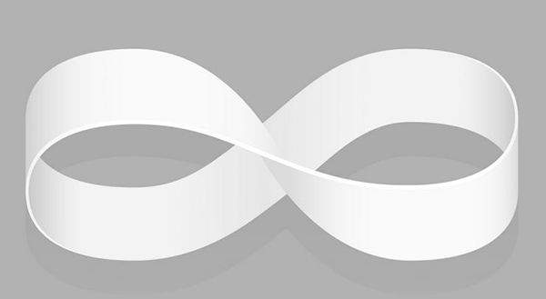
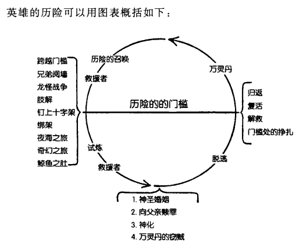

# God

Logic itself is flawed. It emphasizes 1=1, 2=2. But in a higher dimension, it's actually 0=1, 1=0, 1=2.

For example, when things reach an impasse, they change (0-->1); change leads to progress (0=1); progress leads to longevity (1-->0).

## Existence

God is omnipresent; it validates its existence through its own non-existence. Only those who are truly virtuous and have awakened the Ninth Sense can understand this.

Using the Buddhist concept of a pure and self-existent mind, it's easier to understand that the Ninth Sense represents the will of the gods.

The protagonists of *The Melancholy of Haruhi Suzumiya* and *Puella Magi Madoka Magica* are self-proven masterpieces.

In fact, in the secular realm, the highest administrator of a system/enterprise can also be called a god because they have the highest authority.

The first nature of divinity is existence.

## Non-existence

Non-existence is easy to understand. God does not exist because it is an invisible symbol.

The non-existence of something is a false proposition because "n-1" always exists within the dimension of n.

It can also be used to explain some people's atheism. Whether or not one has faith is a matter of personal choice.

## Antinomy

(Non-)uniqueness, (non-)omnipotence, (non-)determinism, and (non-)unity are collectively called antinomy.

**Antinomy is the fundamental logic of God.**

### (Non-)Uniqueness

One is all, and all is one.

#### Uniqueness

In all the universes, both in a broad and narrow sense, there exists a (unique) God. The uniqueness of God is actually easy to understand.

If you've read Greek mythology, you'll find that its core system is a system of chief gods. Zeus ruled everything within that new system of chief gods.

This is very similar to running a business. There can only be one CEO; otherwise, infighting will lead to division. This is the true meaning of "two tigers cannot share one mountain."

There can only be one God.

#### Non-uniqueness

Non-uniqueness means that the "god" is not unique.

This can actually be explained using Greek mythology. Among the twelve Olympian gods, although Zeus is the king of the gods, he does not rule completely dictatorially. He listens to the opinions of other gods and uses their divine power to accomplish his mission.

Non-uniqueness can also be proven using the Möbius strip.

The Möbius strip proves... 1=2. The Möbius strip signifies that the world, after a long period of unity, tends to divide, and after a long period of division, tends to unite.

If time monotonically increases, then two destined individuals are destined to meet, marry, and have children, 2=3. With 2=3, life continues.

The point of meeting is the curvature of spacetime.

If time monotonically decreases, then this process reverses, becoming 3=2, 2=1. Sometimes, the monotonous decrease of time also manifests as a regression in historical progress.

Non-uniqueness also has another meaning: **things from different countries, speaking different languages, with different beliefs, and from different ethnic groups can coexist.**

If the administrator fails to balance internal voices, it will lead to the accelerated collapse of the system.

### (Non)Omnipotence

#### Omnipotence

When there is a will there's a way.

Success or failure is merely a matter of time; this is the effect of conscious awareness.

This is also the content of the [Cause-Effect Law] (chapter_6.md).

Consider the effect first, then the cause. Cast aside double will, fight and fail repeatedly, and eventually achieve success.

#### Incompetence

God cannot lift the stone He cannot lift. Because within a finite time, God's power is limited.

### Indeterminacy

The only constant is change. Indeterminacy is the only certainty.

#### Uncertainty

Uncertainty lies in the fact that everything in the future is based on completely random probability. Subjective thinking can be influenced by the environment and become random.

#### Certainty

Certainty lies in the fact that probability theory is ineffective against God. When God decides to flip a coin, He already knows the outcome.

God's outcome is always primary, and cause is secondary. If events unfold unexpectedly, it indicates that God's abilities are limited by the current dimension; God's incompetence is at play.

### (In)Unity

(In)Unity is called contradiction. Contradiction is the premise that drives the development of things.

#### Inconsistency

In Indian Buddhism, there exists a struggle between Indra and Asura, which manifests in the world of *Naruto*.

In a theological worldview, changes in the world are the playful battles between gods.

#### Unity

Unity can be simply understood as follows: **Good and evil originate from the same source, right and wrong are of the same essence.**

Those who have read the *Tao Te Ching* will have this feeling; all adjectives are relative, because if all logic lacks a premise, then everything is nothingness, a "state of emptiness."

In the divine world, however, good and evil share the same origin, right and wrong are of the same essence, misfortune may be a blessing in disguise, and blessing may be a misfortune in disguise. I believe God exists, but His classification does not follow simple good and evil, light and darkness.

## The Path to Godslaying

Divinity is an inherent attribute of all things.

The key to godslaying lies in "murdering one's past self." That is, recognizing one's past shortcomings and then continuously improving upon them—a process known in dialectical materialism as "negation of negation."

This process is somewhat similar to the sword demon mentioned in Jin Yong's wuxia novel *The Return of the Condor Heroes*—[the swordsmanship of Dugu Qiubai](http://t.cn/A6LCfcH5):

When you maintain a kind nature, take continuous improvement as your responsibility, and reflect on your faults in quiet moments,

when you have the capacity, help others, avoid making major mistakes, and you will continuously refine yourself. Ultimately, you may reach the level of Dugu Qiubai.

Experience is nothing more than training.

Life is short, but time is long. Whether you can navigate danger depends entirely on your own destiny.

When a person can truly answer the questions "Where did I come from? Who am I? Where am I going?", they can begin a new cycle of divine trials.

## Divine Cultivation

In the book *The Hero with a Thousand Faces*, the author breaks down the hero's adventure into:

1. Accepting the call of adventure
1. Crossing the threshold of adventure
1. Embarking on the trials of heroism
1. Receiving external aid
1. Receiving the gifts of fate
1. Escaping the secret chamber
1. Achieving the hero's return

In this endless cycle, the hero will experience extreme pain and receive reward. Only the hero chosen by the gods can see through the contradictions and find the only viable path.

And on his path to godhood, the demons and monsters he encounters are merely creatures that reject the call of divinity.

No matter what they do, they cannot prevent their own demise.

They will use their own flesh and blood as stepping stones on the hero's path.

## Rise of Divinity

Every person's life has meaning. As for the meaning, you must find it yourself. Once you know who you are, that's called knowing your destiny. After knowing your destiny, comes the rise of divinity.

## The Collapse of Divinity

The collapse of divinity refers to the cycle of time, where the new generation replaces the old.

For an example of the collapse of divinity, see *Fullmetal Alchemist: Brotherhood*. The final boss, "The Little Flask," is an example of this.

The Little Flask died because of pride. Pride is the first and most serious sin in the *Seven Deadly Sins* (https://zh.wikipedia.org/wiki/%E4%B8%83%E5%AE%97%E7%BD%AA).

Even though the Little Flask separated himself from his original sin, he betrayed the people of the world. Therefore, the people of the world decided to choose a new master.

The collapse of divinity also manifests as the fading of a hero's life. As the saying goes, time waits for no one and always ages us.

Solving the Prisoner's Dilemma can only verify the (non)existence of God. After verifying the (non)existence of God, I will explain what P Equilibrium is in the next chapter.