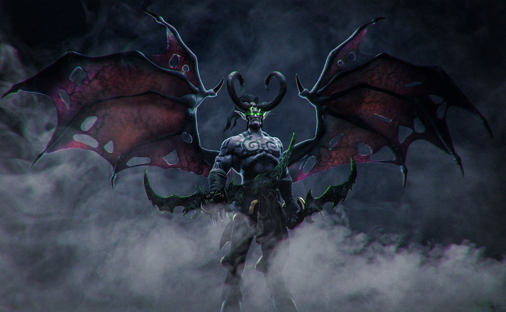

仅以此理论，赐予我所深爱之人。

# 缘起

上帝说：“让牛顿去吧。” 于是一切成为光明。

魔鬼说：“让爱因斯坦去吧。” 于是一切又回到黑暗中。

上帝和撒旦一起说：“让你去吧。” 于是，老子来了！！！

約翰·納什 ：“你这去，定生不良。凭你怎么惹祸行凶，却不许说是我的徒弟，你说出半个字来，我就知之，把你这猢犼剥皮锉骨，将神魂贬在九幽之处，教你万劫不得翻身！”

我帮大家翻译一下就是，他嘲讽我看不懂他论文写的哪怕一个符号（哥们只有高中学历，高考只考了444分）。
然后还嘱咐我烧一台 `Mac Studio` 给他，并帮他通个网。我说你他妈早就死了，还惦记着你那破论文干嘛？
活人的事情活人办，死人的事情死人搞。

这部著作也只是我偷偷抄的，算是一种终极哲学/神学解释，不是我本人所写，有些内容是我胡编乱造加上去的，原版我忘了在哪里。

## 章节介绍

1. [序言](chapter_0.md)
1. [狭义宇宙](chapter_1.md)
2. [广义宇宙](chapter_2.md)
3. [维度之间的联系](chapter_3.md)
4. [神](chapter_4.md)
5. [P均衡](chapter_5.md)
1. [词汇表](chapter_6.md)

## me

षितिगर्भ
