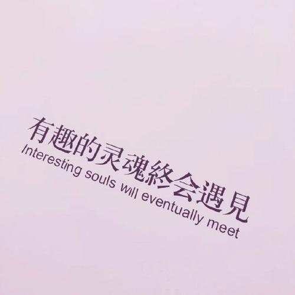

# 我眼中的世界

“我眼中的世界”是一个相对概念，你可以用你自己的理解，去理解你所在的世界。

在我的理解里面，[“现实世界”只是一个超强虚幻引擎](https://github.com/p-program/The-Seed)。

## 创立这个世界的初衷

主要是无聊，打发下永恒的时间。

## 神之科学

别TM再分什么人文，社会科学了，未来一世纪，我们的后人们，将会以信息技术为基础，以信息技术构建的交叉学科，不断重构这个世界。

## 神之数（理）学

### 传统物理常量

传统物理常量皆为本神无聊时乱敲键盘导致的结果。由于本神时间无限，故数字长度无限，最终变成了无理数。

光速，圆周率，e，黄金分割率，光速皆然。

### 能量（人品）守恒定律

引入灵魂的质量,符号同 m 。

凡事祸福相依。

### 灵魂（数据）引力场

只要你像我如此这般才华东西南北溢，那么你就能吸引很多人的喜欢/讨厌。

逃离他人的引力场需要升维的思想，升维主要看个人的思考速度，当然，最重要的是利他的人品。

## 如何找到你的终生伴侣

以莫比乌斯环为例子：

如果你放2个人在莫比乌斯环上面，只要他们速度不一致，到最后他们必定会相遇。但是，如果两个人都停止，那么肯定是找不到彼此的啦~ 所以我在回答哲学三大问题的时候说了，如果你不知道自己是谁，那么就应该多出去走走。

最优策略就是不断试错，找到唯一解。

更优策略就是不断试错，找到更优解（⚠️诚哥警告⚠️：可能会被打死）。

婚姻是爱情的坟墓（里程碑）。在达成里程碑事件之前，要多有耐心。比如，你可以跟TA一起出去旅行，看对方怎么安排行程。不过出门注意“人身安全”哦！意外“搞出人命”，那就麻烦了。所谓**艺术的源泉是悲剧**。你的悲剧成为了其他人眼中的“**艺术**”。

参考链接：

1. [出轨经济学：自命不凡，大意失金](https://www.huxiu.com/article/352220.html)

## 我眼中的中国教育

一切事物，无分对错正负。科学本一家，文理本同体。强行分文理，学理弱泡妞，学文不懂理。

### 只有竞争没有合作

高考只是一个无聊的，整体边际收益接近于零的算力竞赛。虽然是蛮公平的，但是学的知识没啥用。

所谓尺有所长，寸有所短。众生平等，职业教育与高等教育之间并没有孰优孰劣之分。职业教育提倡的工程能力其实是物理实验中强调的动手能力。正确的教育是寓教于乐，因材施教，因势利导。基础教育中的知识只是高等教育中的基石。引导学生自主学习才是正道。

像我们高中当年有研究性学习。成员有爱看A片的残脆弟，假装思考其实脑袋空空的香肠嘴，本学渣，还有阿总理。我们最终的算法，是选了阿总理当master，然后我们其余所有人全部划水。

### 科研腐败

教育行政化，教授只 care 发论文，不教学生。问题是他们教的内容也严重脱离实际。

### 面向终态

若理论不联系实际，那么一切理论毫无意义。

以信息技术来说，大学本科学的都是那些底层逻辑，相当枯燥。如果一开始就让学生们参与开源，顺带熟悉GitHub 的工作流程，再顺便授人以渔。岂不是更好吗？

学习的终态是工作。不得不说，因为高等教育的失败，才催生了那么大一个IT培训市场。

## 真理=睡觉

真理在于不变，变化是唯一的不变。（不）确定性是唯一的确定性。

如果要我说什么是真理。我觉得是睡觉。

睡觉是一门学问。这门学问在于下班睡觉，上班睡觉，甚至天下暴雨，地震了也能随时随地睡觉。这TM才是睡觉的最高境界。

## 命运是完备系统

你可以向你自身命运发起挑战。

## 回答哲学三大问题

凡人角度：我不知道自己从何而来(第一个问题不可解)，所以我要踏上旅程，寻回真正的自我，当我知道自己是谁之后，自然知道要去哪里。

神之角度：我从N+1维世界而来，本神要重新定义这个世界。